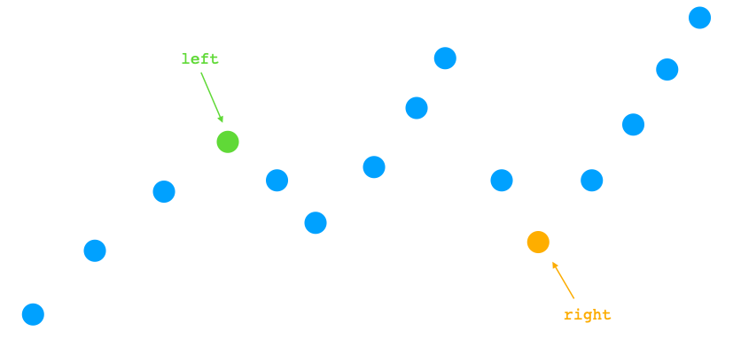
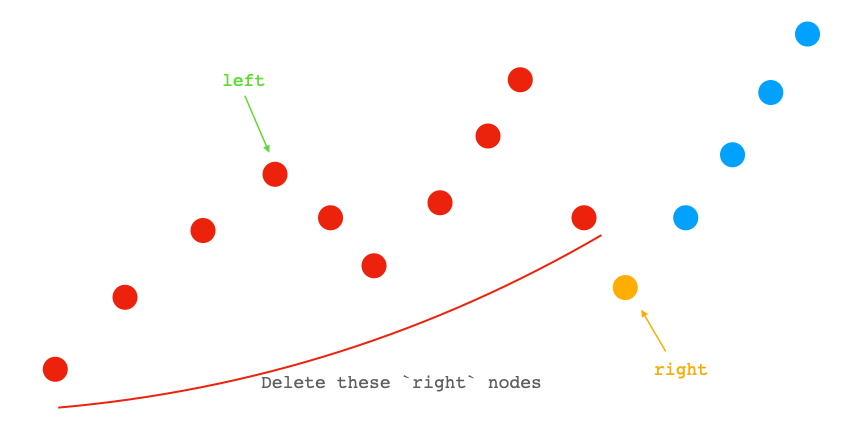
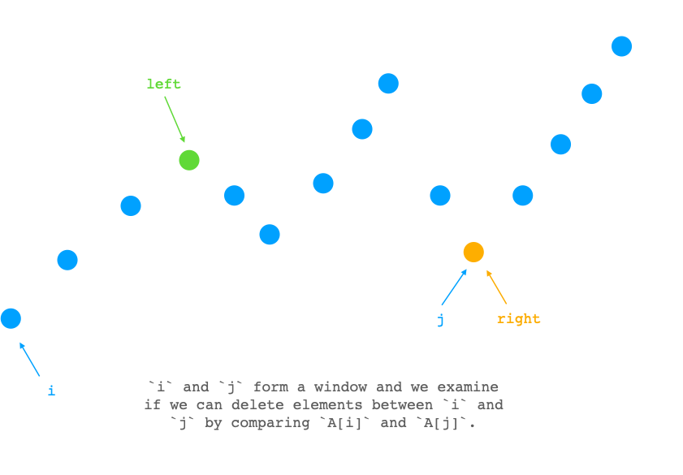
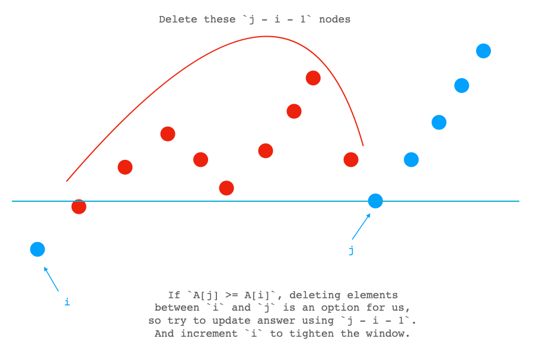
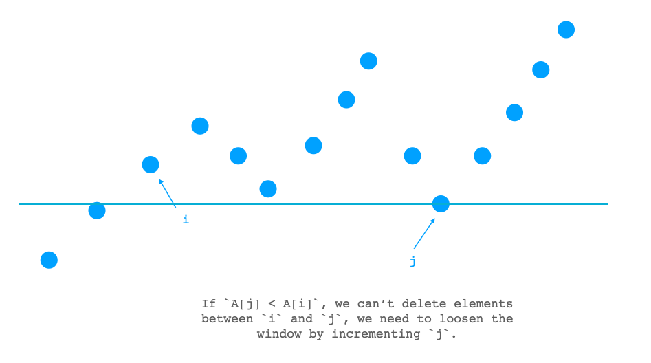

# [1574. Shortest Subarray to be Removed to Make Array Sorted (Medium)](https://leetcode.com/problems/shortest-subarray-to-be-removed-to-make-array-sorted/)

<p>Given an integer array&nbsp;<code>arr</code>, remove a&nbsp;subarray (can be empty) from&nbsp;<code>arr</code>&nbsp;such that the remaining elements in <code>arr</code>&nbsp;are <strong>non-decreasing</strong>.</p>

<p>A subarray is a contiguous&nbsp;subsequence of the array.</p>

<p>Return&nbsp;<em>the length of the shortest subarray to remove</em>.</p>

<p>&nbsp;</p>
<p><strong>Example 1:</strong></p>

<pre><strong>Input:</strong> arr = [1,2,3,10,4,2,3,5]
<strong>Output:</strong> 3
<strong>Explanation: </strong>The shortest subarray we can remove is [10,4,2] of length 3. The remaining elements after that will be [1,2,3,3,5] which are sorted.
Another correct solution is to remove the subarray [3,10,4].</pre>

<p><strong>Example 2:</strong></p>

<pre><strong>Input:</strong> arr = [5,4,3,2,1]
<strong>Output:</strong> 4
<strong>Explanation: </strong>Since the array is strictly decreasing, we can only keep a single element. Therefore we need to remove a subarray of length 4, either [5,4,3,2] or [4,3,2,1].
</pre>

<p><strong>Example 3:</strong></p>

<pre><strong>Input:</strong> arr = [1,2,3]
<strong>Output:</strong> 0
<strong>Explanation: </strong>The array is already non-decreasing. We do not need to remove any elements.
</pre>

<p><strong>Example 4:</strong></p>

<pre><strong>Input:</strong> arr = [1]
<strong>Output:</strong> 0
</pre>

<p>&nbsp;</p>
<p><strong>Constraints:</strong></p>

<ul>
	<li><code>1 &lt;= arr.length &lt;= 10^5</code></li>
	<li><code>0 &lt;= arr[i] &lt;= 10^9</code></li>
</ul>


**Related Topics**:  
[Array](https://leetcode.com/tag/array/), [Binary Search](https://leetcode.com/tag/binary-search/)

## Solution 1. Two Pointers

Scan from left to right, find the first index `left` that `A[left] > A[left + 1]`.

If `left == N - 1`, this array is already non-descending, return `0`.

Scan from right to left, find the first index `right` that `A[right] < A[right - 1]`.



Now we loosely have two options, either deleting the left-side `right` nodes, or deleting the right-side `N - left - 1` nodes.




So the answer is at most `min(N - left - 1, right)`.

Now we can use a sliding window / two pointers to get tighter result.

Let `i = 0, j = right`. And we examine if we can delete elements between `i` and `j` (exclusive) by comparing `A[i]` and `A[j]`.



**Case 1:** `A[j] >= A[i]`, we can delete elements inbetween, so we can try to update the answer using `j - i - 1` and increment `i` to tighten the window.



**Case 2:** `A[j] < A[i]`, we can't delete elements inbetween, so we increment `j` to loosen the window.



We loop until `i > left` or `j == N`. And the answer we get should be the minimal possible solution.

```cpp
// OJ: https://leetcode.com/problems/shortest-subarray-to-be-removed-to-make-array-sorted/
// Author: github.com/lzl124631x
// Time: O(N)
// Space: O(1)
// Ref: https://leetcode.com/problems/shortest-subarray-to-be-removed-to-make-array-sorted/discuss/830416/Java-Increasing-From-Left-Right-and-Merge-O(n)
class Solution {
public:
    int findLengthOfShortestSubarray(vector<int>& A) {
        int N = A.size(), left = 0, right = N - 1;
        while (left + 1 < N && A[left] <= A[left + 1]) ++left;
        if (left == N - 1) return 0;
        while (right > left && A[right - 1] <= A[right]) --right;
        int ans = min(N - left - 1, right), i = 0, j = right;
        while (i <= left && j < N) {
            if (A[j] >= A[i]) {
                ans = min(ans, j - i - 1);
                ++i;
            } else ++j;
        }
        return ans;
    }
};
```