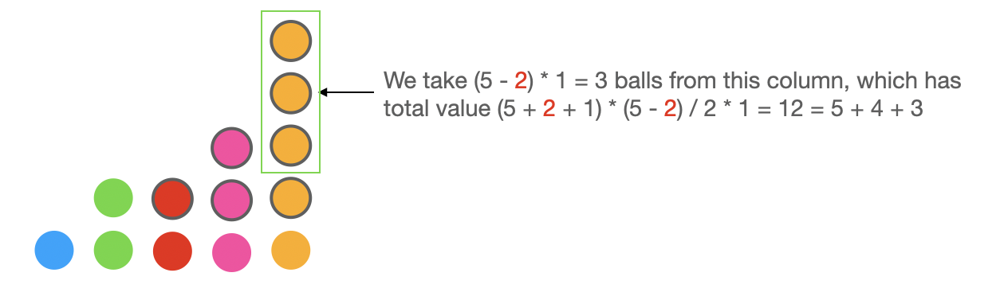
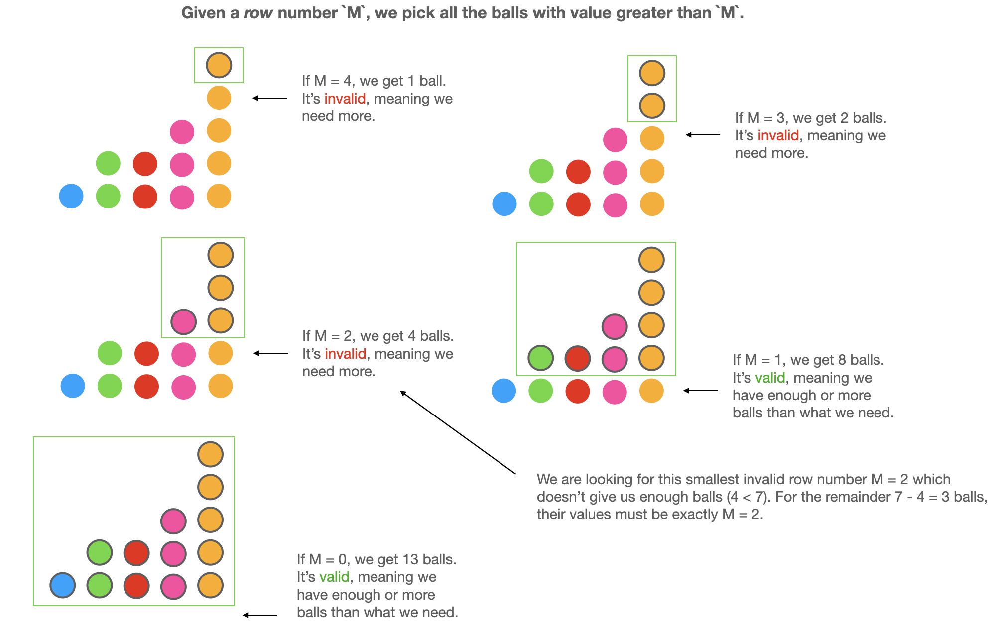
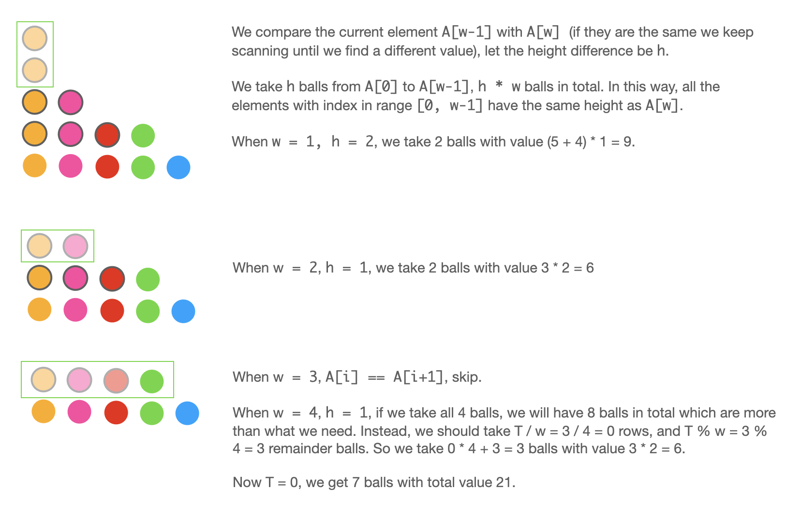

# [1648. Sell Diminishing-Valued Colored Balls (Medium)](https://leetcode.com/problems/sell-diminishing-valued-colored-balls/)

<p>You have an <code>inventory</code> of different colored balls, and there is a customer that wants <code>orders</code> balls of <strong>any</strong> color.</p>

<p>The customer weirdly values the colored balls. Each colored ball's value is the number of balls <strong>of that color&nbsp;</strong>you currently have in your <code>inventory</code>. For example, if you own <code>6</code> yellow balls, the customer would pay <code>6</code> for the first yellow ball. After the transaction, there are only <code>5</code> yellow balls left, so the next yellow ball is then valued at <code>5</code> (i.e., the value of the balls decreases as you sell more to the customer).</p>

<p>You are given an integer array, <code>inventory</code>, where <code>inventory[i]</code> represents the number of balls of the <code>i<sup>th</sup></code> color that you initially own. You are also given an integer <code>orders</code>, which represents the total number of balls that the customer wants. You can sell the balls <strong>in any order</strong>.</p>

<p>Return <em>the <strong>maximum</strong> total value that you can attain after selling </em><code>orders</code><em> colored balls</em>. As the answer may be too large, return it <strong>modulo </strong><code>10<sup>9 </sup>+ 7</code>.</p>

<p>&nbsp;</p>
<p><strong>Example 1:</strong></p>

<pre><strong>Input:</strong> inventory = [2,5], orders = 4
<strong>Output:</strong> 14
<strong>Explanation:</strong> Sell the 1st color 1 time (2) and the 2nd color 3 times (5 + 4 + 3).
The maximum total value is 2 + 5 + 4 + 3 = 14.
</pre>

<p><strong>Example 2:</strong></p>

<pre><strong>Input:</strong> inventory = [3,5], orders = 6
<strong>Output:</strong> 19
<strong>Explanation: </strong>Sell the 1st color 2 times (3 + 2) and the 2nd color 4 times (5 + 4 + 3 + 2).
The maximum total value is 3 + 2 + 5 + 4 + 3 + 2 = 19.
</pre>

<p><strong>Example 3:</strong></p>

<pre><strong>Input:</strong> inventory = [2,8,4,10,6], orders = 20
<strong>Output:</strong> 110
</pre>

<p><strong>Example 4:</strong></p>

<pre><strong>Input:</strong> inventory = [1000000000], orders = 1000000000
<strong>Output:</strong> 21
<strong>Explanation: </strong>Sell the 1st color 1000000000 times for a total value of 500000000500000000. 500000000500000000 modulo 10<sup>9 </sup>+ 7 = 21.
</pre>

<p>&nbsp;</p>
<p><strong>Constraints:</strong></p>

<ul>
	<li><code>1 &lt;= inventory.length &lt;= 10<sup>5</sup></code></li>
	<li><code>1 &lt;= inventory[i] &lt;= 10<sup>9</sup></code></li>
	<li><code>1 &lt;= orders &lt;= min(sum(inventory[i]), 10<sup>9</sup>)</code></li>
</ul>


**Related Topics**:  
[Math](https://leetcode.com/tag/math/), [Greedy](https://leetcode.com/tag/greedy/), [Sort](https://leetcode.com/tag/sort/)

## Solution 1. Binary Answer

### Intuition

We should greedily pick the greatest number `A[i]` from `A`, add `A[i]` to answer and then `A[i]--`.

The simple solution would be using max heap to simulate the above process. But it will get TLE.

To solve it more efficiently, we can break this problem into two steps:

1. Find the smallest number `k` such that we make all `A[i] > k` to be `k`, and `sum(A[i] - k)` (i.e. the number of balls we take) is smaller than `T`. We can do this using binary search.
2. Based on `k`, we can calculate the maximum total value.


### Algorithm

For **Step 1**, I first store the frequencies of `A[i]` in a map. The range of `k` is `[0, max(A)]`, so we do binary search within this range.

Let `L = 0, R = max(A)`.

We define a `valid(M, T)` function which returns true if `sum(A[i] - M | A[i] > M) >= T`.

The smaller the `M` is, the more likely `valid(M, T)` returns true.

If `valid(M, T)`, we should increase `M`, so `L = M + 1`. Otherwise, we do `R = M - 1`.

In the end, `L` is the `k` we are looking for.

For **Step 2**, we traverse the `m` in descending order. For each pair `n, cnt` that `n > L`, we will take `cnt * (n - L)` balls from it which has total value `(n + L + 1) * (n - L) / 2 * cnt`.




If after traversing the `m`, `T` is still not exhausted, we should add `L * T` to the answer.


```cpp
// OJ: https://leetcode.com/contest/weekly-contest-214/problems/sell-diminishing-valued-colored-balls/
// Author: github.com/lzl124631x
// Time: O(Nlog(max(A)))
// Space: O(N)
class Solution {
    map<int, int, greater<>> m;
    bool valid(int M, int T) {
        for (auto &[n, cnt] : m) {
            if (n <= M) break;
            T -= cnt * (n - M);
            if (T <= 0) return true;
        }
        return T <= 0;
    }
public:
    int maxProfit(vector<int>& A, int T) {
        long ans = 0, mod = 1e9+7, L = 0, R = *max_element(begin(A), end(A));
        for (int n : A) m[n]++;
        while (L <= R) {
            long M = (L + R) / 2;
            if (valid(M, T)) L = M + 1;
            else R = M - 1;
        }
        for (auto &[n, cnt] : m) {
            if (n <= L) break;
            T -= cnt * (n - L);
            ans = (ans + (n + L + 1) * (n - L) / 2 % mod * cnt % mod) % mod;
        }
        if (T) ans = (ans + L * T % mod) % mod;
        return ans;
    }
};
```

### About `valid` function

> We define a `valid(M, T)` function which returns true if `sum(A[i] - M | A[i] > M) >= T`.

The meaning of this `valid(M, T)` function is that if we pick all the balls with value greater than `M`, the number of balls we will get is greater than or equal to our target amount of balls `T`. So a better function name could be `haveEnoughBalls`.

The binary search is looking for the smallest `M` which is invalid, or can't get us enough balls. And for the remainder, we are sure those balls are of value `M`.




### Summary of my thinking process

1. If I directly use min heap to simulate the process, the time complexity is `O(sum(A) * logN)` which is too slow (the max heap solution can be improved as well if we don't decrement the numbers by one). Is there a way to improve it?
2. We are always taking high value balls from top to bottom, like stripping the balls row by row from the top. What if I somehow know that I should strip all the balls above the `k`-th row? Can I efficiently calculate the values?
3. Yes I can. I can use the formula of the sum of arithmetic sequence to get the values of each column. And for the remainders, they must be at the `k`-th row so their values are `k`.
4. Now the problem is how to find this `k` efficiently? The meaning of it is the smallest row number which doesn't give me enough ball. Does it have monotonicity?
5. Yes! At the beginning we strip no balls so we don't have enough balls, let's regard this as invalid. As we strip downwards, we will get more and more balls until a breakpoint where we get enough or more balls than we need. If we continue stripping, we will keep being valid. So it has perfect monotonicity, which means that I can use binary search!
6. To use binary search in range `[L, R] = [0, max(A)]`, I need to define a function `valid(M)` meaning having enough balls. It should return `true` if `sum( A[i] - M | A[i] > M ) >= T`. We can do this `valid(M)` in `O(N)` time.
7. Since the binary search takes `O(log(max(A)))` time, the overal time complexity is `O(Nlog(max(A)))`. Good to go.

### More Binary Answer Problems
* [410. Split Array Largest Sum \(Hard\)](https://leetcode.com/problems/split-array-largest-sum/)
* [1482. Minimum Number of Days to Make m Bouquets \(Medium\)](https://leetcode.com/problems/minimum-number-of-days-to-make-m-bouquets/)
* [1300. Sum of Mutated Array Closest to Target \(Medium\)](https://leetcode.com/problems/sum-of-mutated-array-closest-to-target/)
* [1044. Longest Duplicate Substring \(Hard\)](https://leetcode.com/problems/longest-duplicate-substring/)
* [668. Kth Smallest Number in Multiplication Table (Hard)](https://leetcode.com/problems/kth-smallest-number-in-multiplication-table/)
* [719. Find K-th Smallest Pair Distance (Hard)](https://leetcode.com/problems/find-k-th-smallest-pair-distance/)
* [1283. Find the Smallest Divisor Given a Threshold (Medium)](https://leetcode.com/problems/find-the-smallest-divisor-given-a-threshold/)

## Solution 2. Sort + Greedy



```cpp
// OJ: https://leetcode.com/contest/weekly-contest-214/problems/sell-diminishing-valued-colored-balls/
// Author: github.com/lzl124631x
// Time: O(NlogN)
// Space: O(1)
// Ref: https://www.youtube.com/watch?v=kBxqAnWo9Wo
class Solution {
public:
    int maxProfit(vector<int>& A, int T) {
        sort(rbegin(A), rend(A)); // sort in descending order
        long mod = 1e9+7, N = A.size(), cur = A[0], ans = 0, i = 0;
        while (T) {
            while (i < N && A[i] == cur) ++i; // handle those same numbers together
            long next = i == N ? 0 : A[i], h = cur - next, r = 0, cnt = min((long)T, i * h);
            if (T < i * h) { // the i * h balls are more than what we need.
                h = T / i; // we just reduce the height by `T / i` instead
                r = T % i; 
            }
            long val = cur - h; // each of the remainder `r` balls has value `cur - h`.
            ans = (ans + (cur + val + 1) * h / 2 * i + val * r) % mod;
            T -= cnt;
            cur = next;
        }
        return ans;
    }
};
```