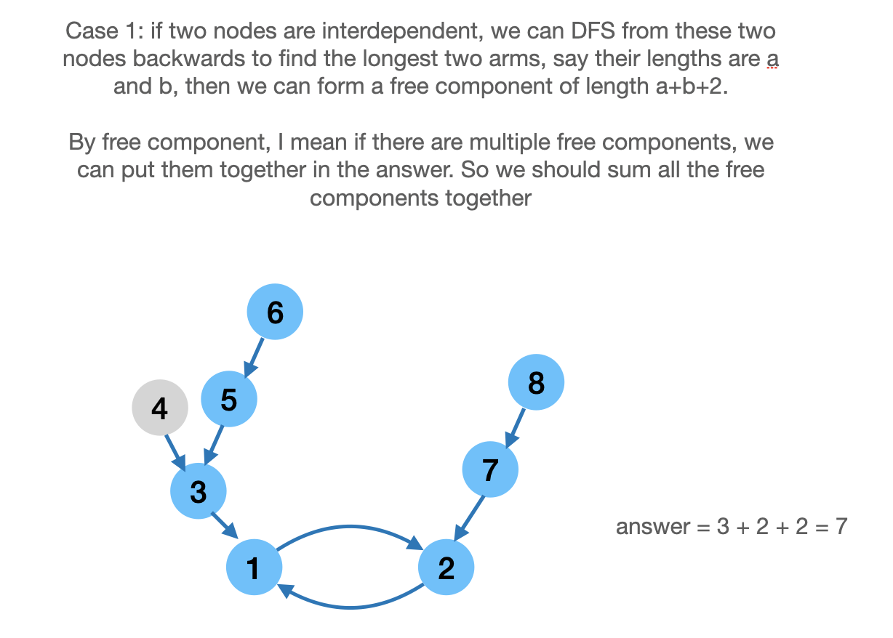
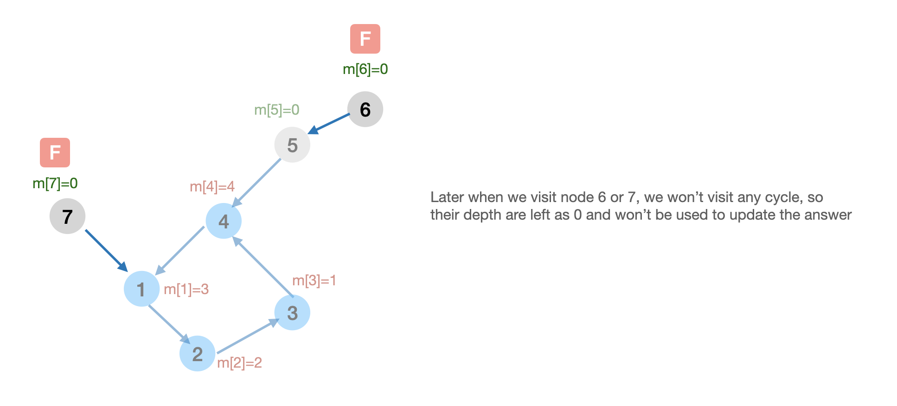

# [2127. Maximum Employees to Be Invited to a Meeting (Hard)](https://leetcode.com/problems/maximum-employees-to-be-invited-to-a-meeting/)

<p>A company is organizing a meeting and has a list of <code>n</code> employees, waiting to be invited. They have arranged for a large <strong>circular</strong> table, capable of seating <strong>any number</strong> of employees.</p>

<p>The employees are numbered from <code>0</code> to <code>n - 1</code>. Each employee has a <strong>favorite</strong> person and they will attend the meeting <strong>only if</strong> they can sit next to their favorite person at the table. The favorite person of an employee is <strong>not</strong> themself.</p>

<p>Given a <strong>0-indexed</strong> integer array <code>favorite</code>, where <code>favorite[i]</code> denotes the favorite person of the <code>i<sup>th</sup></code> employee, return <em>the <strong>maximum number of employees</strong> that can be invited to the meeting</em>.</p>

<p>&nbsp;</p>
<p><strong>Example 1:</strong></p>

<pre><strong>Input:</strong> favorite = [2,2,1,2]
<strong>Output:</strong> 3
<strong>Explanation:</strong>
The above figure shows how the company can invite employees 0, 1, and 2, and seat them at the round table.
All employees cannot be invited because employee 2 cannot sit beside employees 0, 1, and 3, simultaneously.
Note that the company can also invite employees 1, 2, and 3, and give them their desired seats.
The maximum number of employees that can be invited to the meeting is 3. 
</pre>

<p><strong>Example 2:</strong></p>

<pre><strong>Input:</strong> favorite = [1,2,0]
<strong>Output:</strong> 3
<strong>Explanation:</strong> 
Each employee is the favorite person of at least one other employee, and the only way the company can invite them is if they invite every employee.
The seating arrangement will be the same as that in the figure given in example 1:
- Employee 0 will sit between employees 2 and 1.
- Employee 1 will sit between employees 0 and 2.
- Employee 2 will sit between employees 1 and 0.
The maximum number of employees that can be invited to the meeting is 3.
</pre>

<p><strong>Example 3:</strong></p>

<pre><strong>Input:</strong> favorite = [3,0,1,4,1]
<strong>Output:</strong> 4
<strong>Explanation:</strong>
The above figure shows how the company will invite employees 0, 1, 3, and 4, and seat them at the round table.
Employee 2 cannot be invited because the two spots next to their favorite employee 0 are taken.
So the company leaves them out of the meeting.
The maximum number of employees that can be invited to the meeting is 4.
</pre>

<p>&nbsp;</p>
<p><strong>Constraints:</strong></p>

<ul>
	<li><code>n == favorite.length</code></li>
	<li><code>2 &lt;= n &lt;= 10<sup>5</sup></code></li>
	<li><code>0 &lt;= favorite[i] &lt;=&nbsp;n - 1</code></li>
	<li><code>favorite[i] != i</code></li>
</ul>


**Similar Questions**:
* [Redundant Connection (Medium)](https://leetcode.com/problems/redundant-connection/)
* [Parallel Courses III (Hard)](https://leetcode.com/problems/parallel-courses-iii/)
* [Process Restricted Friend Requests (Hard)](https://leetcode.com/problems/process-restricted-friend-requests/)

## Solution 1. DFS




The answer is the maximum of:
* the **sum** of all case 1 components
* the **maximum** of case 2 components




```cpp
// OJ: https://leetcode.com/problems/maximum-employees-to-be-invited-to-a-meeting/
// Author: github.com/lzl124631x
// Time: O(N)
// Space: O(N)
class Solution {
public:
    int maximumInvitations(vector<int>& A) {
        int N = A.size();
        vector<int> m(N, -1); // m[i] is the depth of node i. -1 means unvisited
        vector<vector<int>> r(N); // The reverse graph
        for (int i = 0; i < N; ++i) r[A[i]].push_back(i);
        // handle case 1
        function<int(int)> dfs = [&](int u) {
            if (m[u] != -1) return m[u];
            int ans = 0;
            for (int v : r[u]) ans = max(ans, dfs(v));
            return m[u] = 1 + ans;
        };
        int ans = 0, free = 0;
        for (int i = 0; i < N; ++i) {
            if (m[i] != -1) continue; // skip visited nodes
            if (A[A[i]] == i) {
                m[i] = m[A[i]] = 0;
                int a = 0, b = 0; // find the length of the longest arms starting from `i` and `A[i]`
                for (int v : r[i]) {
                    if (v == A[i]) continue;
                    a = max(a, dfs(v));
                }
                for (int v : r[A[i]]) {
                    if (v == i) continue;
                    b = max(b, dfs(v));
                }
                free += a + b + 2; // this free component is of length `a+b+2`
            }
        }
        // handle case 2
        function<tuple<int, int, bool>(int)> dfs2 = [&](int u)->tuple<int, int, bool> {
            if (m[u] != -1) return {u, m[u], false}; // We visited this node the second time, so this node must be the entry point to the cycle
            m[u] = 0;
            auto [entryPoint, depth, cycleVisited] = dfs2(A[u]);
            if (cycleVisited) { // After the cycle being traversed, any other node in the backtracking process are outside of the cycle and should be ignored (by keeping m[u] as 0).
                return {entryPoint, depth, true};
            }
            m[u] = 1 + depth; // If we haven't met the entry point again, this is a node within the cycle, so we increment the depth.
            return {entryPoint, m[u], u == entryPoint}; // When we visit the entry point again, we know what we've done traversing the cycle.
        };
        for (int i = 0; i < N; ++i) {
            if(m[i] != -1) continue;
            auto [entryPoint, depth, cycleVisited] = dfs2(i);
            if (cycleVisited) ans = max(ans, depth);
        }
        return max(ans, free);
    }
};
```

## Discuss

https://leetcode.com/problems/maximum-employees-to-be-invited-to-a-meeting/discuss/1660944/C%2B%2B-DFS-with-illustration