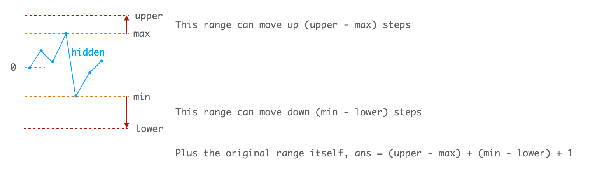

# [2145. Count the Hidden Sequences (Medium)](https://leetcode.com/problems/count-the-hidden-sequences/)

<p>You are given a <strong>0-indexed</strong> array of <code>n</code> integers <code>differences</code>, which describes the <strong>differences </strong>between each pair of <strong>consecutive </strong>integers of a <strong>hidden</strong> sequence of length <code>(n + 1)</code>. More formally, call the hidden sequence <code>hidden</code>, then we have that <code>differences[i] = hidden[i + 1] - hidden[i]</code>.</p>

<p>You are further given two integers <code>lower</code> and <code>upper</code> that describe the <strong>inclusive</strong> range of values <code>[lower, upper]</code> that the hidden sequence can contain.</p>

<ul>
	<li>For example, given <code>differences = [1, -3, 4]</code>, <code>lower = 1</code>, <code>upper = 6</code>, the hidden sequence is a sequence of length <code>4</code> whose elements are in between <code>1</code> and <code>6</code> (<strong>inclusive</strong>).

	<ul>
		<li><code>[3, 4, 1, 5]</code> and <code>[4, 5, 2, 6]</code> are possible hidden sequences.</li>
		<li><code>[5, 6, 3, 7]</code> is not possible since it contains an element greater than <code>6</code>.</li>
		<li><code>[1, 2, 3, 4]</code> is not possible since the differences are not correct.</li>
	</ul>
	</li>
</ul>

<p>Return <em>the number of <strong>possible</strong> hidden sequences there are.</em> If there are no possible sequences, return <code>0</code>.</p>

<p>&nbsp;</p>
<p><strong>Example 1:</strong></p>

<pre><strong>Input:</strong> differences = [1,-3,4], lower = 1, upper = 6
<strong>Output:</strong> 2
<strong>Explanation:</strong> The possible hidden sequences are:
- [3, 4, 1, 5]
- [4, 5, 2, 6]
Thus, we return 2.
</pre>

<p><strong>Example 2:</strong></p>

<pre><strong>Input:</strong> differences = [3,-4,5,1,-2], lower = -4, upper = 5
<strong>Output:</strong> 4
<strong>Explanation:</strong> The possible hidden sequences are:
- [-3, 0, -4, 1, 2, 0]
- [-2, 1, -3, 2, 3, 1]
- [-1, 2, -2, 3, 4, 2]
- [0, 3, -1, 4, 5, 3]
Thus, we return 4.
</pre>

<p><strong>Example 3:</strong></p>

<pre><strong>Input:</strong> differences = [4,-7,2], lower = 3, upper = 6
<strong>Output:</strong> 0
<strong>Explanation:</strong> There are no possible hidden sequences. Thus, we return 0.
</pre>

<p>&nbsp;</p>
<p><strong>Constraints:</strong></p>

<ul>
	<li><code>n == differences.length</code></li>
	<li><code>1 &lt;= n &lt;= 10<sup>5</sup></code></li>
	<li><code>-10<sup>5</sup> &lt;= differences[i] &lt;= 10<sup>5</sup></code></li>
	<li><code>-10<sup>5</sup> &lt;= lower &lt;= upper &lt;= 10<sup>5</sup></code></li>
</ul>


## Solution 1.

Assume `hidden[0] = 0`.

We can get all `hidden[i+1] = hidden[i] + diff[i]`.

The `hidden` array forms a polyline. Assume the max/min values are `max`/`min`.

By changing `hidden[0]`, we can shift this range up or down.

If we snap `max` to `upper`, we move up by `upper - max` steps. Then the number of possible of hidden sequences is `min + (upper - max) - lower + 1`.


Another way to think about it:



```cpp
// OJ: https://leetcode.com/problems/count-the-hidden-sequences/
// Author: github.com/lzl124631x
// Time: O(N)
// Space: O(1)
class Solution {
public:
    int numberOfArrays(vector<int>& A, int lower, int upper) {
        long sum = 0, mn = 0, mx = 0;
        for (int n : A) {
            sum += n;
            mn = min(mn, sum);
            mx = max(mx, sum);
        }
        return max(0L, mn - mx + upper - lower + 1);
    }
};
```

## Discuss

https://leetcode.com/problems/count-the-hidden-sequences/discuss/1709710/C%2B%2B-One-pass-O(N)-time