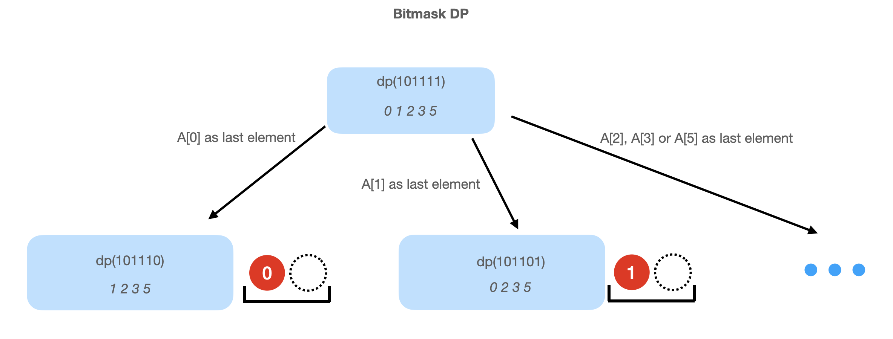

# [2172. Maximum AND Sum of Array (Hard)](https://leetcode.com/problems/maximum-and-sum-of-array/)

<p>You are given an integer array <code>nums</code> of length <code>n</code> and an integer <code>numSlots</code> such that <code>2 * numSlots &gt;= n</code>. There are <code>numSlots</code> slots numbered from <code>1</code> to <code>numSlots</code>.</p>

<p>You have to place all <code>n</code> integers into the slots such that each slot contains at <strong>most</strong> two numbers. The <strong>AND sum</strong> of a given placement is the sum of the <strong>bitwise</strong> <code>AND</code> of every number with its respective slot number.</p>

<ul>
	<li>For example, the <strong>AND sum</strong> of placing the numbers <code>[1, 3]</code> into slot <u><code>1</code></u> and <code>[4, 6]</code> into slot <u><code>2</code></u> is equal to <code>(1 AND <u>1</u>) + (3 AND <u>1</u>) + (4 AND <u>2</u>) + (6 AND <u>2</u>) = 1 + 1 + 0 + 2 = 4</code>.</li>
</ul>

<p>Return <em>the maximum possible <strong>AND sum</strong> of </em><code>nums</code><em> given </em><code>numSlots</code><em> slots.</em></p>

<p>&nbsp;</p>
<p><strong>Example 1:</strong></p>

<pre><strong>Input:</strong> nums = [1,2,3,4,5,6], numSlots = 3
<strong>Output:</strong> 9
<strong>Explanation:</strong> One possible placement is [1, 4] into slot <u>1</u>, [2, 6] into slot <u>2</u>, and [3, 5] into slot <u>3</u>. 
This gives the maximum AND sum of (1 AND <u>1</u>) + (4 AND <u>1</u>) + (2 AND <u>2</u>) + (6 AND <u>2</u>) + (3 AND <u>3</u>) + (5 AND <u>3</u>) = 1 + 0 + 2 + 2 + 3 + 1 = 9.
</pre>

<p><strong>Example 2:</strong></p>

<pre><strong>Input:</strong> nums = [1,3,10,4,7,1], numSlots = 9
<strong>Output:</strong> 24
<strong>Explanation:</strong> One possible placement is [1, 1] into slot <u>1</u>, [3] into slot <u>3</u>, [4] into slot <u>4</u>, [7] into slot <u>7</u>, and [10] into slot <u>9</u>.
This gives the maximum AND sum of (1 AND <u>1</u>) + (1 AND <u>1</u>) + (3 AND <u>3</u>) + (4 AND <u>4</u>) + (7 AND <u>7</u>) + (10 AND <u>9</u>) = 1 + 1 + 3 + 4 + 7 + 8 = 24.
Note that slots 2, 5, 6, and 8 are empty which is permitted.
</pre>

<p>&nbsp;</p>
<p><strong>Constraints:</strong></p>

<ul>
	<li><code>n == nums.length</code></li>
	<li><code>1 &lt;= numSlots &lt;= 9</code></li>
	<li><code>1 &lt;= n &lt;= 2 * numSlots</code></li>
	<li><code>1 &lt;= nums[i] &lt;= 15</code></li>
</ul>


**Similar Questions**:
* [Minimum XOR Sum of Two Arrays (Hard)](https://leetcode.com/problems/minimum-xor-sum-of-two-arrays/)

## Solution 1. Bitmask DP

**Intuition**:

If we permuate the numbers and assign them to the slots sequentially (`A[0]` and `A[1]` into slot `1`, `A[2]` and `A[3]` into slot `2`, ...), we need to go over at most `18!` permutations which will result in TLE.

It's wasting computation because it computes the same subproblem over and over again. For example, assume we assigned `A[0] to A[9]` 10 elements to the first `5` slots. For the first element in slot `6`, we have `A[10] to A[17]` 8 options. But no matter which one we choose, the best arrangment for the first 10 elements is fixed. Instead of computing it `8` times, we can just compute it once and reuse it later. This leads to a DP solution.

The DP idea is that we use bitmask `m` to represent which elements are selected, and try picking each one of them as the last element and assign it to `(bitCount(m) + 1) / 2`-th slot. The state transition is `dp[m - (1 << i)] -> dp[m]` where `m`'s `i`-th bit is `1`.




**Algorithm**:

Append `0`s to make sure the length of `A` is `2 * numSlots`.

Let `dp[m]` be the maximum score given a bitmask `m` representing the selected numbers. The final answer is `dp[(1 << N) - 1]`.

Assume `m`'s `i`-th bit is `1`, we have the following formula:

```
dp[m] = max( dp[m - (1 << i)] + (slotNumber & A[i]) | m's i-th bit is 1 )
                        where slotNumber = (cnt + 1) / 2 and cnt = bitCount(m)
```

The key is that we always make this picked `A[i]` as the last element of all elements in `m` and assign it to `slotNumber`-th slot, and `slotNumber` is a constant given `m`.

**Why `slotNumber = (cnt + 1) / 2`?**
* If `cnt = 1`, we put this first element at slot `1`.
* If `cnt = 2` meaning two elements are selected, we pick one of them as the last element and put it in slot `1`.
* If `cnt = 3` meaning three elements are seledted, we pick one of them as the last element and put it in slot `2`.
* ans so on...

So the `cnt` to `slotNumber` mapping is `1 or 2 -> 1`, `3 or 4 -> 2`, ... i.e. `slotNumber = (cnt + 1) / 2`.

**Example of State Transition**:

Assume `m = 1101`, we'll assign `A[i]` to slot `(bitCount(m) + 1) / 2 = (3 + 1) / 2 = 2`:
* If `i = 0`, `dp[1101] = dp[1100] + (2 & A[0])`
* If `i = 2`, `dp[1101] = dp[1001] + (2 & A[2])`
* If `i = 3`, `dp[1101] = dp[0101] + (2 & A[3])`.

```cpp
// OJ: https://leetcode.com/problems/maximum-and-sum-of-array/
// Author: github.com/lzl124631x
// Time: O(2^(2*numSlots) * numSlots)
// Space: O(2^(2*numSlots))
class Solution {
public:
    int maximumANDSum(vector<int>& A, int numSlots) {
        A.resize(2 * numSlots); // append 0s to make sure the length of `A` is `2 * numSlots`
        int N = A.size();
        vector<int> dp(1 << N);
        for (int m = 1; m < 1 << N; ++m) {
            int cnt = __builtin_popcount(m), slot = (cnt + 1) / 2; 
            for (int i = 0; i < N; ++i) {
                if (m >> i & 1) { // we assign A[i] to `slot`-th slot
                    dp[m] = max(dp[m], dp[m ^ (1 << i)] + (slot & A[i]));
                }
            }
        }
        return dp[(1 << N) - 1];
    }
};
```

## Discuss

https://leetcode.com/problems/maximum-and-sum-of-array/discuss/1766743