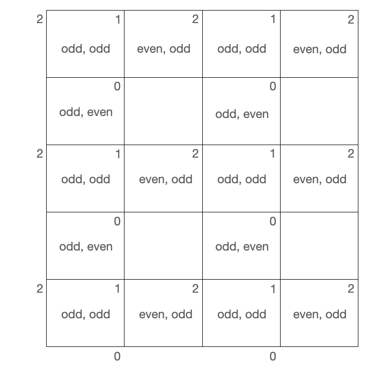

# [858. Mirror Reflection (Medium)](https://leetcode.com/problems/mirror-reflection/)

<p>There is&nbsp;a special square room with mirrors on each of the four&nbsp;walls.&nbsp; Except for the southwest&nbsp;corner, there are receptors on each of the remaining corners, numbered <code>0</code>, <code>1</code>, and <code>2</code>.</p>

<p>The square room has walls of length <code>p</code>, and a laser ray from the southwest corner&nbsp;first meets the east wall at a distance <code>q</code>&nbsp;from the <code>0</code>th receptor.</p>

<p>Return the number of the receptor that the ray meets first.&nbsp; (It is guaranteed that the ray will meet&nbsp;a receptor eventually.)</p>

<p>&nbsp;</p>

<div>
<p><strong>Example 1:</strong></p>

<pre><strong>Input: </strong>p = <span id="example-input-1-1">2</span>, q = <span id="example-input-1-2">1</span>
<strong>Output: </strong><span id="example-output-1">2</span>
<strong>Explanation: </strong>The ray meets receptor 2 the first time it gets reflected back to the left wall.

</pre>

<p><strong>Note:</strong></p>

<ol>
	<li><code>1 &lt;= p &lt;= 1000</code></li>
	<li><code>0 &lt;= q &lt;= p</code></li>
</ol>
</div>


**Related Topics**:  
[Math](https://leetcode.com/tag/math/)

## Solution 1. Simulation

The equation of the ray is `(y - y1) / ry = (x - x1) / rx`.

We start from `x = 0, y = 0` and `rx = p, ry = q`.

After time `t` the ray will be at `(a, b) = (x + rx * t, y + ry * t)`. We want to find the smallest positive `t` which makes `(a, b)` be at `(0, p)`, `(p, 0)` or `(p, p)`.

At time `t`, if the ray lands on
* the west edge, then `x + rx * t = 0` so `t = -x / rx`.
* the south edge, then `y + ry * t = 0`, so `t = -y / ry`.
* the east edge, then `x + rx * t = p`, so `t = (p - x) / rx`.
* the north edge, then `y + ry * t = p`, so `t = (p - y) / ry`.

We can try the four edges, and the smallest positive time `t` is the time we should take because it takes us to the next landing edge.

```cpp
// OJ: https://leetcode.com/problems/mirror-reflection/
// Author: github.com/lzl124631x
// Time: O(P)
// Space: O(1)
// Ref: https://leetcode.com/problems/mirror-reflection/solution/
class Solution {
    double eps = 1e-6;
    bool equal(double x, double y) {
        return abs(x - y) < eps;
    }
public:
    int mirrorReflection(int p, int q) {
        double x = 0, y = 0, rx = p, ry = q;
        while (!(
                (equal(x, p) && (equal(y, 0) || equal(y, p))) // touches 0 or 1
                 || (equal(x, 0) && equal(y, p)) // touches 2
            )) {
            double t = 1e9;
            if ((-x / rx) > eps) t = min(t, -x / rx); // try reaching west edge (set the new x to be 0)
            if ((-y / ry) > eps) t = min(t, -y / ry); // try reaching south edge (set the new y to be 0)
            if ((p - x) / rx > eps) t = min(t, (p - x) / rx); // try reaching east edge (set the new x to be p)
            if ((p - y) / ry > eps) t = min(t, (p - y) / ry); // try reaching north edge (set the new y to be p)
            x += rx * t; // we take the closest reacheable edge
            y += ry * t;
            if (equal(x, p) || equal(x, 0)) rx *= -1; // if touches west or east edge, flip rx
            else ry *= -1;  // otherwise flip ry.
        }
        if (equal(x, p) && equal(y, p)) return 1;
        return equal(x, p) ? 0 : 2;
    }
};
```

## Solution 2. Math

Instead of bounceing back, just let the ray go straight. The first receptor the ray touches is at `(kp, kq)` where `k` is integer and `kq` is a multiple of `p`. So the goal is the find the smallest integer `k` for which `kq` is a multiple of `p`.

The mathematical answer is `k = p / gcd(p, q)`.

`p /= k` and `q /= k` reduces `p` and `q` to the base cases where `p` and `q` are coprime. For example, `p = 9, q = 6` is reduced to `p = 3, q = 2`.

Then `p` and `q` won't be both even otherwise they are not coprime.

So we just have 3 cases:

`p` and `q` are
1. odd, odd
2. odd, even
3. even, odd

respectively

Each case has a fixed top-right value as shown in the figure below.



So the pattern is:
* `p` is odd and `q` is odd the result is `1`.
* `p` is odd and `q` is even, the result is `0`.
* `p` is even and `q` is odd, the result is `2`.

```cpp
// OJ: https://leetcode.com/problems/mirror-reflection/
// Author: github.com/lzl124631x
// Time: O(logP)
// Space: O(1)
// Ref: https://leetcode.com/problems/mirror-reflection/solution/
class Solution {
    int gcd(int p, int q) {
        return q ? gcd(q, p % q) : p;
    }
public:
    int mirrorReflection(int p, int q) {
        int k = gcd(p, q);
        p /= k; p %= 2;
        q /= k; q %= 2;
        if (p == 1 && q == 1) return 1;
        return p == 1 ? 0 : 2;
    }
};
```

# Solution 3.

Similar to Solution 2, but we don't need to compute the GCD. Simply keep dividing `p` and `q` by `2` until they are not both even. Then we use the parity of `p` and `q` to determine the result.

```cpp
// OJ: https://leetcode.com/problems/mirror-reflection/
// Author: github.com/lzl124631x
// Time: O(logP)
// Space: O(1)
// Ref: https://leetcode.com/problems/mirror-reflection/discuss/141765/Java-short-solution-with-a-sample-drawing
class Solution {
public:
    int mirrorReflection(int p, int q) {
        while (p % 2 == 0 && q % 2 == 0) p /= 2, q /= 2;
        if (p % 2 && q % 2) return 1;
        return p % 2 ? 0 : 2;
    }
};
```

Or

```cpp
// OJ: https://leetcode.com/problems/mirror-reflection/
// Author: github.com/lzl124631x
// Time: O(logP)
// Space: O(1)
class Solution {
public:
    int mirrorReflection(int p, int q) {
        while (p % 2 == 0 && q % 2 == 0) p /= 2, q /= 2;
        return 1 + (q & 1) - (p & 1);
    }
};
```